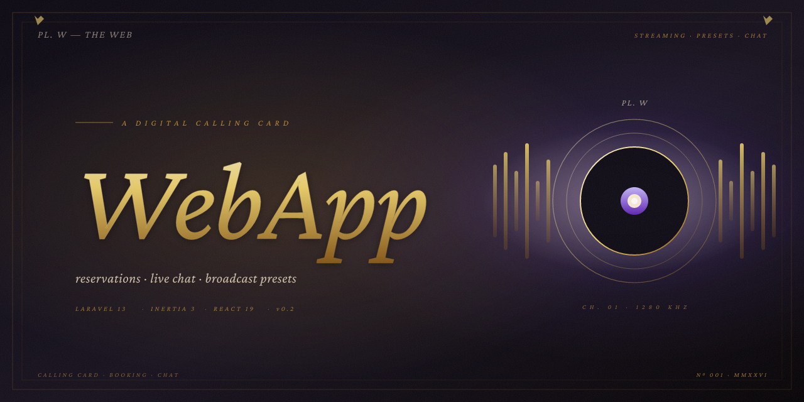

# WebApp v0.2



Plataforma **todo-en-uno** para que tu negocio tenga presencia online con **reservas** y **tarjeta de presentación digital**. Construido con **Laravel 13 + Inertia 3 + React 19**.

## ¿Qué es WebApp?

WebApp combina **tres pilares** en una sola plataforma:

1. **Tarjeta de presentación digital** — Una página web profesional, personalizable y lista para publicar sin tocar código.
2. **Sistema de reservas** — Un calendario para que tus clientes agenden turnos o eventos.
3. **Chat en Vivo** — Un botón flotante en tu sitio donde los visitantes te escriben y vos respondés desde el panel.

Pensado para peluquerías, streamers, restaurantes, profesionales independientes y cualquier negocio que necesite presencia online + gestión de clientes.

## Stack

- **PHP 8.3** · **Laravel 13**
- **Inertia.js 3** · **React 19** · **TypeScript**
- **Tailwind CSS v4** · **shadcn/ui** (Radix UI)
- **Spatie Permission** (roles + permisos)
- **Spatie MediaLibrary** (biblioteca de medios)
- **Laravel Reverb** (WebSockets para chat en tiempo real)
- **Laravel Wayfinder** (rutas TypeScript tipadas)
- **Puck Editor** (editor visual drag-and-drop de páginas)
- **Leaflet + OpenStreetMap** (mapas)
- **FullCalendar v7** (calendario)
- **Laravel Pint** · **Pest 4** · **Larastan**
- **pm2** (gestión de procesos en producción)

## Características

### 👥 Multiusuario
- CRUD de usuarios con roles (`admin`, `user`)
- Permisos granulares: `manage-users`, `manage-roles`, `manage-media`, `manage-templates`, `manage-settings`
- Roles por defecto: `admin` (todos los permisos) y `user` (sin permisos administrativos)
- Verificación de email
- Soporte para passkeys (WebAuthn) y two-factor authentication (TOTP) vía Fortify

### 📄 Páginas dinámicas (tarjeta de presentación digital)
Editor visual drag-and-drop con **Puck**. Las páginas se construyen con dos tipos de elementos:

- **13 bloques básicos**: Título, Párrafo, Imagen, Botón, Espaciador, Divisor, Galería, Video, Mapa, Antes/Después, Cronómetro, Estadísticas, Agenda Semanal
- **9 secciones prediseñadas**: Hero, Características, Galería, Planes/Precios, FAQ, Testimonios, Equipo, Servicios, Ubicación, Llamado a la acción

Los datos se persisten en `site_templates.sections` (JSON) y `site_template_blocks` (tabla relacional).

### 🎨 Plantillas prediseñadas
Elegí entre plantillas listas para usar según tu rubro:

- **Peluquería** — Para peluquerías y barberías. Hero, 6 servicios, galería con 6 trabajos reales, 3 tiers de precios, equipo con 3 fotos, 4 pares antes/después, testimonios, ubicación con mapa y CTA de reserva. Ships con 20 SVGs ilustrados (hero, equipo, galería, servicios, before/after).
- **Streaming** — Para streamers y creadores de contenido. Hero "En vivo" con waveform, 6 plataformas, galería con 6 highlights (setup, win, IRL, torneo, charla, highlights), 3 tiers (Viewer/Sub/Patreon), 3 testimonios con avatar, comunidad, links a Twitch. Ships con 15 SVGs ilustrados + 5 SVGs "sample" para defaults de bloques/secciones.

Ambas plantillas se crean automáticamente con contenido, secciones, bloques, menú pre-armado e imágenes de muestra ya registradas en MediaLibrary.

> **Pipeline de medios**: los presets referencian sus assets como placeholders `__MEDIA:<key>__`. Los seeders (`PeluqueriaTemplateSeeder`, `StreamingTemplateSeeder`) — que comparten el trait `Database\Seeders\Concerns\RegistersCanvasMedia` — registran los SVGs en `MediaHolder` (`peluqueria-canvas` / `streaming-canvas`) y resuelven los placeholders a IDs numéricos. `App\Support\TemplateMediaUrl::enrichSections` también resuelve los placeholders en render-time para que los bloques/secciones recién arrastrados al canvas muestren la imagen de muestra sin re-seed.

### 💬 Chat en Vivo
WebSockets con **Laravel Reverb** (protocolo Pusher). El visitante ve un botón flotante en tu sitio, se loguea con email + teléfono (sin contraseña, registro rápido), y te escribe. Vos respondés desde el panel.

- Mensajes en tiempo real sin recargar
- Badge de no leídos en el botón flotante cuando el admin envía
- Lista de conversaciones con contador de no leídos
- Adjuntar archivos (imágenes, PDFs)
- Estados: abierto / cerrado
- Persistencia del estado abierto/cerrado en `sessionStorage`
- Channel auth para canales privados

### 📅 Calendario y reservas
- Vista mensual, semanal y diaria (FullCalendar v7)
- CRUD de eventos con fecha, hora y descripción
- Endpoints JSON para actualización sin recarga
- Exportación de eventos a JSON

### 🖼️ Biblioteca de medios (`/admin/media`)
- Subida de archivos (imágenes, videos, audio, PDFs)
- Filtros por tipo y origen
- Búsqueda por nombre
- **Panel lateral de detalle** con preview según tipo (imagen/video/audio/PDF)
- URL pública copiable, dimensiones de imagen, descargar
- Conversión `thumb` automática para imágenes

### 🧭 Menú de navegación (`/admin/site-menu`)
- Items del header público con **sub-menús** (parent_id recursivo)
- 35+ íconos Lucide elegibles vía picker visual
- Reordenamiento con flechas ↑↓
- Switch de visibilidad
- Filtrado por template activo (cada página tiene su propio menú)

### ⚙️ Configuración del sitio (`/admin/site-settings`)
Configuración global: nombre, eslogan, SEO (título + descripción), logo, favicon, página activa.

### 📊 Dashboard (`/admin`)
- **Estado del socket** (conectado/desconectado en tiempo real)
- 4 métricas: mensajes hoy, chats abiertos, sin leer, pico de hoy
- Gráfico de **mensajes por hora** de las últimas 24 horas
- Auto-actualización vía WebSocket cuando llegan mensajes nuevos

### 🛡️ Seguridad
- **Laravel Fortify** (login, registro, recuperación de contraseña)
- **Two-factor authentication** (TOTP) y **passkeys** (WebAuthn)
- **HTTPS forzado** vía Nginx/SSL
- **Trusted proxies** configurado (X-Forwarded-Proto)
- **CSRF protection** en todos los forms
- **Channel auth** en broadcasts (solo owner o admin)

### 🌐 Sitio público
- Renderizado desde la página activa
- **Responsive** (mobile/tablet/desktop)
- **Dark/light mode** automático según sistema operativo
- Geolocalización con **OpenStreetMap + Leaflet** (sin API key, gratis)
- SEO básico (title, description, favicon)
- Soporte para dominio personalizado + SSL (Let's Encrypt vía Hestia)

## Documentación del cliente

La documentación para el usuario final (en español) está en **`resources/docs/0.1/`** usando **LaRecipe 2.2**.

Disponible en **`/docs/0.1/overview`** con:
- Overview, Getting Started, Dashboard
- Multiusuario, Páginas dinámicas, Plantillas prediseñadas
- Chat en Vivo, Calendario y reservas
- Biblioteca de medios, Menú de navegación, Configuración del sitio
- FAQ

## Credenciales por defecto

- **Email**: `admin@admin.com`
- **Password**: `Admin2026$`

## Comandos

```bash
# Instalar dependencias
composer install
npm install

# Setup inicial
php artisan migrate:fresh --seed
php artisan storage:link
npm run build

# Regenerar JSON de un preset después de editar preset-templates.ts
node scripts/export-preset-for-seeder.mjs        # streaming
node scripts/export-preset-for-seeder.mjs        # peluquería (mismo script)

# Producción (con pm2)
pm2 start ecosystem.config.cjs
pm2 save
```

## Assets de marca

- `public/canvas/peluqueria/` — 20 SVGs ilustrados del preset Peluquería
- `public/canvas/streaming/` — 15 SVGs ilustrados del preset Streaming + 5 sample defaults
- `canvas-tarjeta-digital.{svg,png,pdf}` — artefacto canvas del brief de marca
- `canvas-philosophy.md` — filosofía de diseño **Embossed Voltage** que rige los SVGs

## Licencia

MIT